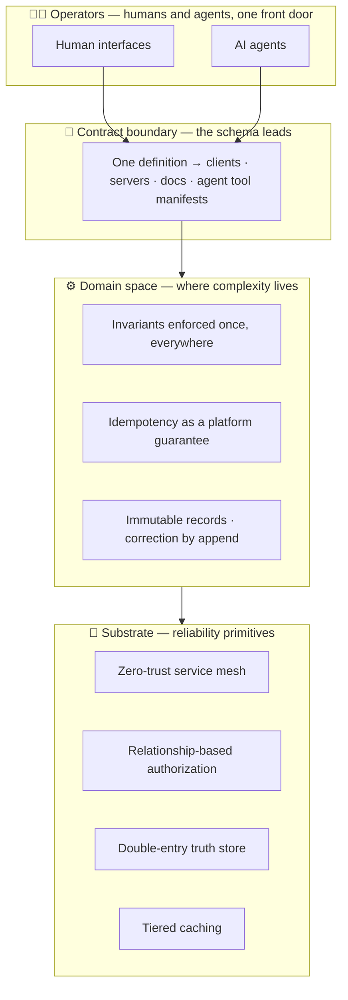

<!-- Animated typing header -->

**Director of Engineering, Commerce · [HighLevel](https://www.gohighlevel.com)**

*Building the systems that let millions of small businesses sell, invoice, and get paid.*

 

---

## 🎯 Focus

Systems that scale across four hard axes:

| Axis | What it means in practice |
|---|---|
| 🌊 **Millions of sessions** | Checkout, invoicing, and document surfaces that hold up under real merchant traffic |
| 🛰️ **Distributed app fleets** | Multi-tenant services on GKE with strict service boundaries and mTLS everywhere |
| 🌍 **Global commerce constraints** | Payments, tax, compliance, and currency realities across markets |
| 🤝 **Human + AI workflows** | APIs designed so agents and people operate the same platform through the same contracts |

---

## 🏗️ How I design systems

Every system I build settles into the same shape — a layered substrate where each layer absorbs a class of problems so the layers above stay simple:

The pattern behind the layers: complexity flows downward until it reaches the layer built to own it. Operators — human or agent — see one contract. The contract generates everything downstream. The domain enforces every invariant exactly once. The substrate makes correctness the default rather than a per-feature effort.

---

## 🧰 Depth

### Backend

- Service boundaries as a first-class design artifact — domain tiers, experience tiers, and per-niche translators
- Financial-grade data modeling: immutable documents, double-entry ledgers, idempotency as a platform guarantee
- Relationship-based authorization (ReBAC) for agency → location → resource hierarchies
- AI-first orchestration: protobuf-annotated services that self-describe as MCP tools

### Frontend

- Large-scale state & caching systems
- Modular distribution architectures for app fleets
- BFF systems evolved into per-niche translation layers
- 📜 **US Patent 12,316,707 B1**

---

## 🤖 AI-native infrastructure

The interesting question of this decade: what does a commerce platform look like when its primary operators include software agents?

My current answers, in code and writing:

- **Protobuf → MCP codegen** — generating Model Context Protocol tool manifests directly from service definitions, so the API contract and the agent contract stay one artifact
- **Governance-aware annotations** — tool-level metadata (risk, side-effects, tenancy) declared in the schema, enforced at the boundary
- **ConnectRPC in production** — one wire contract serving browsers, mobile, service-to-service traffic, and agents

### 🔭 Active exploration

- **Durable execution with Temporal** — long-running workflows (migrations, replays, reconciliation, agent task chains) modeled as durable, resumable programs, so a crashed process resumes exactly where it stopped
- **AI governance** — how policy, risk tiers, audit trails, and human-approval gates attach to agent-invocable tools: declared in the schema, enforced at runtime, reviewable after the fact

---

## 🧑‍✈️ Engineering leadership

Leading two organizations at once: six years building the mobile organization to 20+ engineers, and the past year building the commerce organization to 40+ engineers across seven teams. How I run things:

- **User experience as proof of work** — took the mobile platform from 6,000 MAU and declining to 600,000 MAU and climbing: a 100× turnaround over five years, earned through platform rewrites, large-scale state & caching work, and modular distribution
- **Cadence as infrastructure** — the org runs on written, reviewable artifacts: team charters, quarterly business reviews, leveling memos, and recognition that names specific work. If it matters, it has a document and a rhythm
- **Teams that operate without a manager** — every engineer owns a single, clearly written charter; decisions route through the charter and the contract, so the team keeps shipping when any one person (including me) steps away
- **Coresphere** — a co-authored design philosophy for the platform's surfaces: nine tenets, with external builders treated as a first-class audience from day one

---

## 🧭 Philosophy

> Great engineering moves complexity out of the user space and into the system space.

- **Eliminate classes of problems.** A fixed bug helps once; a fixed invariant helps forever.
- **Reliability protects revenue.** Every 9 in a checkout path has a dollar value.
- **Abstractions compound.** The right primitive today is a hundred features tomorrow.
- **Platform empathy.** Build every internal surface as if you personally get paged for its rough edges.
- **Contracts first.** When the schema leads, the docs, clients, and agents all follow for free.

---

## 🌱 Community & beyond

- 🎤 Active in the cloud-native and MCP ecosystems — KubeCon + CloudNativeCon India, Open Source Summit India, MCP Dev Summit
- 🌉 Building internship pipelines that bring open-source contributors (GSoC / LFX alumni) into production engineering teams
- ✍️ Writing about Kubernetes, API architecture, and building agent-ready platforms
- 🎸 Chasing clean tones on a Yamaha Strat; listening on far-too-carefully-chosen IEMs
- 🥭 Planting a mango orchard in Jharkhand — the ultimate exercise in long-term systems thinking: water infrastructure first, harvest ladder second, patience throughout
- 🛸 Logging training hours in FPV drone simulators — acro mode is muscle memory earned one crash at a time

---

## 🎯 Direction

**Accessible, intelligent commerce infrastructure for SMBs worldwide** — where a two-person business gets the same financial substrate, the same reliability, and the same AI leverage as an enterprise.

---

<!-- GitHub stats — replace username; delete this block if you prefer a quieter profile -->

  

*Systems worth building are the ones still running when you've moved on.*

